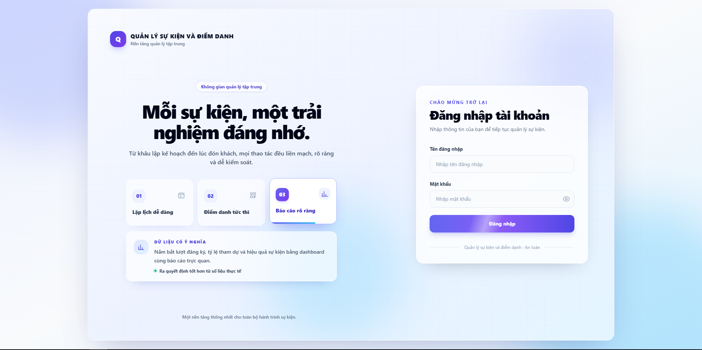
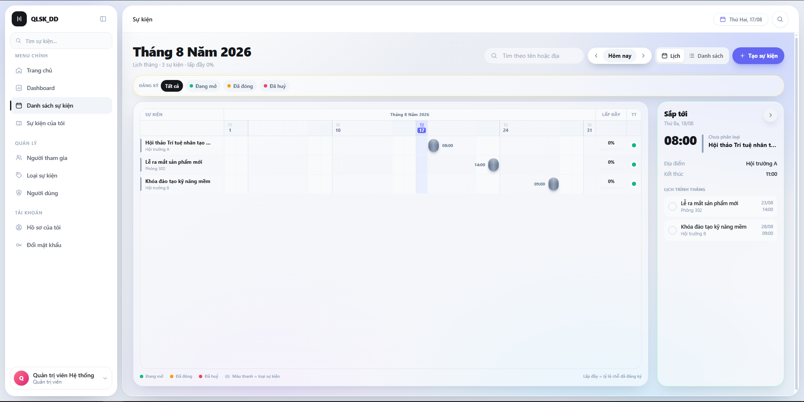
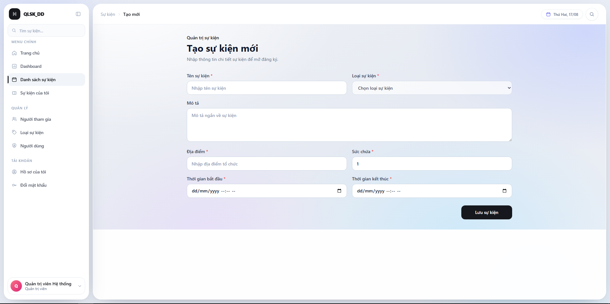
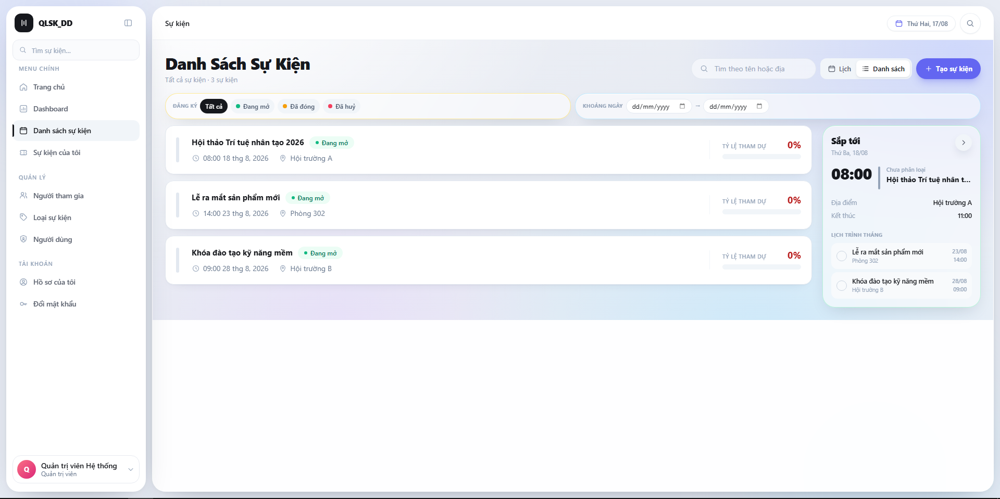
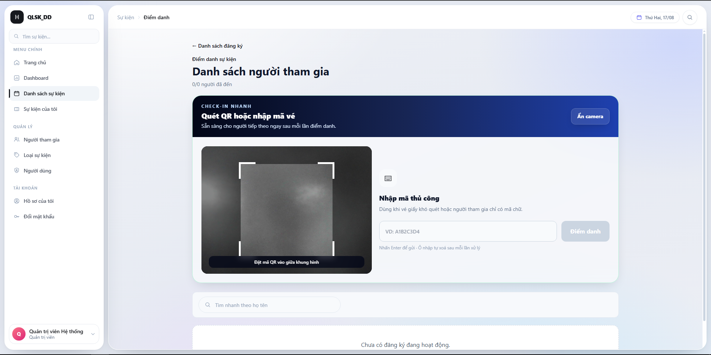
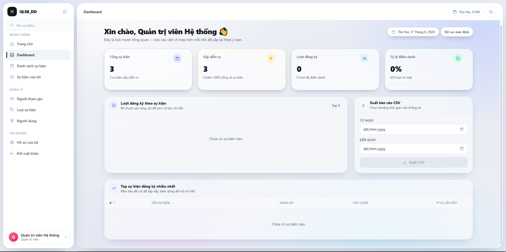
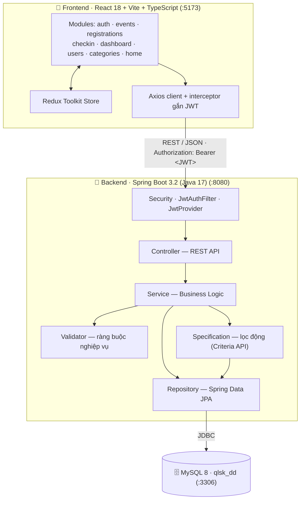

<div align="center">

# QLSKDD

### Hệ thống Quản lý Sự kiện & Điểm danh bằng mã QR

_Từ khâu tạo sự kiện → mở đăng ký → phát vé QR → điểm danh tại cửa → cho tới báo cáo thống kê, tất cả trong một nền tảng._


</div>

---

## Nội dung

| | |
|---|---|
| [1. Giới thiệu](#1-giới-thiệu) | [7. Cài đặt & chạy dự án](#7-cài-đặt--chạy-dự-án) |
| [2. Nghiệp vụ chính](#2-nghiệp-vụ-chính) | [8. Tài khoản mẫu](#8-tài-khoản-mẫu) |
| [3. Ảnh chụp màn hình](#3-ảnh-chụp-màn-hình) | [9. Biến môi trường](#9-biến-môi-trường) |
| [4. Vai trò & phân quyền](#4-vai-trò--phân-quyền) | [10. API Endpoints](#10-api-endpoints) |
| [5. Kiến trúc hệ thống](#5-kiến-trúc-hệ-thống) | [11. Kiểm thử](#11-kiểm-thử) |
| [6. Cấu trúc thư mục](#6-cấu-trúc-thư-mục) | [12. Quy ước phát triển](#12-quy-ước-phát-triển) |
| | [13. Tài liệu & Nhóm phát triển](#13-tài-liệu--nhóm-phát-triển) |

---

## 1. Giới thiệu

**QLSKDD** (Quản Lý Sự Kiện – Điểm Danh) là ứng dụng web quản lý trọn vòng đời một sự kiện, dành cho các đơn vị tổ chức hội thảo, workshop, khóa đào tạo hoặc hoạt động nội bộ.

Hệ thống giải quyết ba bài toán mà cách làm thủ công (Google Form + Excel) không xử lý được:

- **Chống vượt số lượng chỗ (overbooking)** — kiểm soát tồn chỗ ngay ở tầng nghiệp vụ, hết chỗ thì chặn đăng ký bằng `OverbookingException` thay vì để danh sách tràn.
- **Điểm danh nhanh và không gian lận** — mỗi vé mang một mã duy nhất dưới dạng QR, quét một lần; lần quét thứ hai trả về `ALREADY_CHECKED_IN`.
- **Số liệu tức thời** — tỷ lệ tham dự, số vắng mặt, top sự kiện đông nhất hiện ngay trên dashboard và xuất được CSV, thay vì tổng hợp tay sau sự kiện.

## 2. Nghiệp vụ chính

<details open>
<summary><b>🔐 Xác thực & Tài khoản</b></summary>

- Đăng nhập cấp **JWT stateless** (hạn 24 giờ), không giữ session phía server.
- Xem và cập nhật **hồ sơ cá nhân** (`GET` / `PUT /auth/me`), gồm cả ảnh đại diện.
- **Đổi mật khẩu** với thanh đo độ mạnh ở frontend và ràng buộc kiểm tra ở backend.
- Quản trị viên **quản lý tài khoản**: tạo, sửa, khóa/mở khóa, gán vai trò.

</details>

<details open>
<summary><b>📅 Quản lý sự kiện</b></summary>

- CRUD sự kiện: tên, mô tả, địa điểm, thời gian bắt đầu/kết thúc, sức chứa, loại sự kiện.
- Phân loại theo **loại sự kiện** (`EventCategory`) — do quản trị viên quản lý.
- Vòng đời trạng thái: `OPEN` (đang mở) → `CLOSED` (đã đóng) / `CANCELLED` (đã huỷ).
- **Tìm kiếm & lọc động** theo từ khóa, loại, trạng thái, khoảng thời gian; có phân trang và sắp xếp (`sort=field,dir`) qua **JPA Specification**.
- Giao diện xem sự kiện **hai chế độ**: dạng lịch (thanh thời lượng theo ngày) và dạng danh sách.

</details>

<details open>
<summary><b>🎟️ Đăng ký tham dự</b></summary>

- Người dùng đăng ký / huỷ đăng ký; mỗi người chỉ giữ một suất cho mỗi sự kiện.
- Chặn đăng ký khi **hết chỗ**, sự kiện **đã đóng** hoặc **đã huỷ**.
- Sinh **mã QR vé** (ZXing) để người tham dự xuất trình tại cửa.
- Huỷ đăng ký được bảo vệ ở mức **chủ sở hữu** — người khác không huỷ vé của bạn được, kể cả khi đã đăng nhập.
- Ban tổ chức xem danh sách đăng ký của từng sự kiện và **quản lý người tham gia** riêng.

</details>

<details open>
<summary><b>📷 Điểm danh QR</b></summary>

- Quét mã QR bằng camera thiết bị tại cửa vào (`html5-qrcode`).
- Xác thực vé theo thời gian thực, kết quả trả về: `SUCCESS`, `ALREADY_CHECKED_IN`, `INVALID_TICKET`, `WRONG_EVENT`.
- Lưu **lịch sử điểm danh** (`CheckInHistory`): ai được điểm danh, lúc nào, cho sự kiện nào.
- Hỗ trợ **điểm danh thủ công** theo mã đăng ký khi thiết bị của khách gặp sự cố.
- Trang **có mặt / vắng mặt** lọc theo `ALL` · `PRESENT` · `ABSENT`.

</details>

<details open>
<summary><b>📊 Dashboard & Báo cáo</b></summary>

- Tổng quan: số sự kiện, số lượt đăng ký, số lượt tham dự thực tế, tỷ lệ điểm danh toàn hệ thống.
- **Top sự kiện** đông người đăng ký nhất, kèm biểu đồ (Recharts).
- **Xuất báo cáo CSV** theo khoảng thời gian, gồm tổng đăng ký / có mặt / tỷ lệ tham dự của từng sự kiện.

</details>

## 3. Ảnh chụp màn hình

> Ảnh chụp bằng tài khoản `admin`, lưu tại [docs/screenshots/](docs/screenshots/).

<div align="center">

|  |  |
|---|---|
| **Đăng nhập** | **Danh sách sự kiện** |
|  |  |
| **Tạo sự kiện** | **Danh sách đăng ký** |
|  |  |
| **Điểm danh QR** | **Dashboard thống kê** |
|  |  |

</div>

## 4. Vai trò & phân quyền

| Vai trò | Mã | Quyền hạn |
|---|---|---|
| Quản trị viên | `ROLE_ADMIN` | Toàn quyền: quản lý người dùng, loại sự kiện, mọi sự kiện, xem toàn bộ báo cáo |
| Ban tổ chức | `ROLE_ORGANIZER` | Tạo & quản lý sự kiện, xem danh sách đăng ký, điểm danh, xem thống kê và xuất báo cáo |
| Người tham dự | `ROLE_USER` | Xem & tìm sự kiện, đăng ký / huỷ, xem vé QR và lịch sử tham dự của bản thân |

Phân quyền được thực thi **ba lớp**, cố ý chồng nhau để một chỗ sơ hở không mở toang cả hệ thống:

1. **`SecurityConfig`** — chặn theo pattern URL và HTTP method (ví dụ `PUT /api/v1/users/me/password` chỉ cần đăng nhập, nhưng `/api/v1/users/**` còn lại thuộc `ADMIN`).
2. **`@PreAuthorize`** — đặt ở tầng controller/service, kể cả với những URL đã được cấu hình ở lớp trên.
3. **Kiểm tra chủ sở hữu** — `@registrationSecurityService.isOwner(...)` cho các thao tác lên vé của chính người dùng.

Phía frontend, `RoleRoute` và `usePermission` ẩn chức năng theo quyền — nhưng đây chỉ là lớp trải nghiệm, **không phải lớp bảo mật**; mọi quyết định cho phép/từ chối đều do backend đưa ra.

## 5. Kiến trúc hệ thống

Hệ thống theo mô hình **2 tầng**: frontend là ứng dụng SPA độc lập, giao tiếp với backend hoàn toàn qua REST API.



**Nguyên tắc thiết kế**

- **Layered Architecture** ở backend: `Controller → Service → Repository → Entity`, không nhảy tầng. Controller không tự validate nghiệp vụ, không tự truy vấn.
- **Feature-based Architecture** ở frontend: mỗi module tự chứa `pages`, `components`, `api`, `types` của riêng nó.
- **DTO là biên giới** — entity không bao giờ rò ra ngoài controller; chuyển đổi qua tầng `mapper`.
- **Xử lý lỗi tập trung** — mọi exception đi qua `GlobalExceptionHandler`, trả về `ErrorResponse` với format thống nhất.
- **Response chuẩn hóa** — `BaseRes<T>` cho dữ liệu đơn, `PageRes<T>` cho dữ liệu phân trang.

<details>
<summary><b>Định dạng response chuẩn</b></summary>

```jsonc
// Thành công — BaseRes<T>
{
  "success": true,
  "status": 200,
  "message": "Thành công",
  "data": { /* ... */ },
  "timestamp": "2026-08-17T10:15:30"
}

// Phân trang — BaseRes<PageRes<T>>
{
  "success": true,
  "status": 200,
  "message": "Lấy danh sách sự kiện thành công",
  "data": {
    "content": [],
    "page": 0,
    "size": 10,
    "totalElements": 0,
    "totalPages": 0,
    "last": true
  }
}

// Lỗi — ErrorResponse
{
  "success": false,
  "status": 409,
  "error": "Conflict",
  "message": "Sự kiện đã hết chỗ",
  "errorCode": "OVERBOOKING",
  "path": "/api/v1/registrations",
  "timestamp": "2026-08-17T10:15:30",
  "errors": [ { "field": "capacity", "message": "..." } ]   // chỉ có khi lỗi validation
}
```

Các `errorCode` hiện dùng: `VALIDATION_ERROR` · `BAD_REQUEST` · `BAD_CREDENTIALS` · `UNAUTHORIZED` · `ACCESS_DENIED` · `ACCOUNT_DISABLED` · `DUPLICATE_DATA` · `OVERBOOKING` · `METHOD_NOT_ALLOWED` · `INTERNAL_SERVER_ERROR`.

</details>

## 6. Cấu trúc thư mục

```text
QLSKDD/
│
├── backend/                                # Spring Boot 3.2 · Java 17
│   ├── src/main/java/com/qlskdd/
│   │   ├── QlskddApplication.java          # Entry point
│   │   ├── config/                         # SecurityConfig · SwaggerConfig · DataSeeder
│   │   ├── controller/                     # Auth · User · Event · Category · Registration
│   │   │                                   # Participant · CheckIn · Dashboard · Report
│   │   ├── service/                        # Interface nghiệp vụ
│   │   │   └── impl/                       # Cài đặt nghiệp vụ
│   │   ├── repository/                     # Spring Data JPA Repositories
│   │   ├── entity/                         # User · Role · Event · EventCategory
│   │   │                                   # Registration · CheckInHistory
│   │   ├── dto/request/                    # LoginReq · EventReq · CheckInReq · UserReq · ProfileReq
│   │   ├── mapper/                         # Entity → DTO
│   │   │   └── response/                   # BaseRes · PageRes · ErrorResponse · EventRes · ...
│   │   ├── security/                       # JwtProvider · JwtAuthFilter · UserDetailsService
│   │   ├── specification/                  # EventSpecification — lọc động Criteria API
│   │   ├── validator/                      # Ràng buộc nghiệp vụ sự kiện / đăng ký / mật khẩu
│   │   ├── exception/                      # GlobalExceptionHandler + custom exceptions
│   │   ├── enums/                          # RoleEnum · EventStatus · RegistrationStatus
│   │   │                                   # CheckInStatus · AttendanceFilter
│   │   └── util/                           # QrCode · ExportCsv · Date
│   ├── src/main/resources/
│   │   ├── application.yml                 # Cấu hình chung (profile dev bật sẵn)
│   │   ├── application-dev.yml             # Override cho môi trường dev
│   │   └── application-prod.yml            # Override cho môi trường production
│   ├── src/test/java/com/qlskdd/           # 22 file test · 172 test case
│   ├── mvnw · mvnw.cmd                     # Maven wrapper
│   └── pom.xml
│
├── frontend/                               # React 18 · Vite · TypeScript · Tailwind
│   ├── src/
│   │   ├── main.tsx · App.tsx              # Entry point
│   │   ├── modules/                        # Feature-based
│   │   │   ├── auth/                       # Đăng nhập · hồ sơ · đổi mật khẩu
│   │   │   ├── events/                     # Lịch & danh sách · chi tiết · tạo/sửa
│   │   │   ├── registrations/              # Đăng ký · huỷ · vé QR
│   │   │   ├── checkin/                    # Quét QR & có mặt/vắng
│   │   │   ├── dashboard/                  # Thống kê · biểu đồ · xuất báo cáo
│   │   │   ├── users/ · categories/        # Quản trị tài khoản & loại sự kiện
│   │   │   └── home/                       # Trang chủ
│   │   ├── components/                     # common · layout · ui (Button · Card · Modal · ...)
│   │   ├── layouts/                        # MainLayout (Sidebar + Topbar)
│   │   ├── routers/                        # Public & Private/Role routes
│   │   ├── stores/slices/                  # Redux Toolkit
│   │   ├── hooks/                          # useAuth · usePermission · useDebounce
│   │   ├── configs/                        # Axios client · env
│   │   ├── constants/                      # API paths · routes · roles
│   │   ├── types/ · utils/                 # Kiểu dùng chung · formatter · helper
│   │   ├── assets/styles/index.css         # Tailwind + ngôn ngữ hình khối dùng chung
│   │   └── test/setup.ts                   # Cấu hình Vitest + Testing Library
│   ├── .env.example
│   ├── tailwind.config.js                  # Design tokens (màu · bóng · nền)
│   └── vite.config.ts
│
├── docs/
│   ├── api_contract.md                     # Hợp đồng API đầy đủ
│   ├── database_schema.sql                 # Script khởi tạo CSDL
│   ├── jira_backlog.md                     # Backlog & user story
│   ├── postman/                            # Postman Collection
│   └── screenshots/                        # Ảnh chụp màn hình
│
└── README.md
```

## 7. Cài đặt & chạy dự án

Có hai cách: chạy bằng **Docker** (nhanh nhất, không cần cài gì ngoài Docker) hoặc **chạy trực tiếp** trên máy (phù hợp khi đang phát triển).

### Cách A — Docker, một lệnh duy nhất

Không cần cài JDK, Maven hay Node — mọi thứ build bên trong container. Chỉ cần **Docker Desktop** (Windows: chạy `wsl --install` trong PowerShell Admin rồi khởi động lại máy trước).

```powershell
Copy-Item .env.example .env      # macOS/Linux: cp .env.example .env
```

Mở `.env` sửa **hai** giá trị bắt buộc — `QLSKDD_DB_PASSWORD` và `QLSKDD_JWT_SECRET` — rồi:

```bash
docker compose up -d --build
```

Lần đầu mất 3–5 phút, lần sau vài chục giây nhờ cache. Thiếu biến bắt buộc thì compose dừng ngay với thông báo rõ ràng thay vì khởi động rồi chết giữa chừng.

| Thành phần | URL |
|---|---|
| Ứng dụng | http://localhost:3000 |
| API (trực tiếp, cho Postman) | http://localhost:8080/api/v1 |
| Swagger UI | http://localhost:3000/swagger-ui/index.html |

Đăng nhập bằng `admin` / `admin123` — dữ liệu demo (4 sự kiện, 12 tài khoản, 17 lượt đăng ký) được nạp sẵn.

> Hướng dẫn đầy đủ — bảng biến môi trường, lệnh vận hành, xử lý sự cố, các quyết định thiết kế
> và phần chưa làm: **[docs/deployment.md](docs/deployment.md)**

### Cách B — Chạy trực tiếp trên máy

#### Yêu cầu tiền đề

| Công cụ | Phiên bản tối thiểu |
|---|---|
| JDK | 17 |
| Maven | 3.8+ _(hoặc dùng `mvnw` đi kèm)_ |
| Node.js | 18+ |
| MySQL | 8.0 |

### Bước 1 — Chuẩn bị MySQL

```sql
CREATE DATABASE IF NOT EXISTS qlsk_dd
  CHARACTER SET utf8mb4 COLLATE utf8mb4_unicode_ci;
```

Bảng sẽ được Hibernate **tự tạo** (`ddl-auto: update`) — không cần import schema thủ công. Script tham khảo: [docs/database_schema.sql](docs/database_schema.sql).

Backend đọc mật khẩu MySQL từ biến môi trường `DB_PASSWORD`, **cần set trước khi chạy**:

```powershell
# Windows · PowerShell
$env:DB_PASSWORD = "<mật khẩu MySQL của bạn>"
```

```bash
# macOS / Linux
export DB_PASSWORD="<mật khẩu MySQL của bạn>"
```

### Bước 2 — Chạy Backend (cổng 8080)

```bash
cd backend
./mvnw spring-boot:run          # Windows: mvnw.cmd spring-boot:run
```

| | |
|---|---|
| API base URL | `http://localhost:8080/api/v1` |
| Swagger UI | `http://localhost:8080/swagger-ui/index.html` |
| OpenAPI JSON | `http://localhost:8080/v3/api-docs` |

> Profile `dev` bật sẵn trong `application.yml`. Ở profile này, `DataSeeder` tự nạp 3 vai trò, 3 tài khoản mẫu và 3 sự kiện mẫu — **chỉ khi bảng tương ứng còn rỗng**, nên chạy lại nhiều lần không sinh dữ liệu trùng.

### Bước 3 — Chạy Frontend (cổng 5173)

```bash
cd frontend
npm install
cp .env.example .env            # Windows PowerShell: Copy-Item .env.example .env
npm run dev
```

Ứng dụng mở tại `http://localhost:5173`.

> Backend chỉ cho phép CORS từ `http://localhost:5173` và `http://localhost:3000`. Nếu chạy frontend ở cổng khác, cần bổ sung origin đó trong `SecurityConfig.corsConfigurationSource()`.

### Tóm tắt các cổng

| Thành phần | URL |
|---|---|
| Frontend | http://localhost:5173 |
| Backend | http://localhost:8080 |
| MySQL | localhost:3306 · database `qlsk_dd` |

## 8. Tài khoản mẫu

Khi chạy profile `dev`, hệ thống tự tạo sẵn ba tài khoản để thử nghiệm phân quyền:

| Username | Mật khẩu | Vai trò | Dùng để thử |
|---|---|---|---|
| `admin` | `admin123` | `ROLE_ADMIN` | Quản lý người dùng, loại sự kiện, toàn bộ hệ thống |
| `organizer` | `organizer123` | `ROLE_ORGANIZER` | Tạo sự kiện, điểm danh, xem thống kê, xuất báo cáo |
| `user` | `user123` | `ROLE_USER` | Đăng ký tham dự, xem vé QR, xem sự kiện của tôi |

> [!WARNING]
> Đây là tài khoản seed cho môi trường phát triển. **Không dùng ở production** — hãy đổi mật khẩu hoặc tắt `DataSeeder` (nó đã được giới hạn bằng `@Profile("dev")`).

## 9. Biến môi trường

### Chạy trực tiếp trên máy (cách B)

**Backend** — `backend/src/main/resources/application.yml`:

| Biến | Mặc định (dev) | Mô tả |
|---|---|---|
| `DB_PASSWORD` | — | Mật khẩu MySQL (**bắt buộc**, đọc từ biến môi trường) |
| `APP_JWT_SECRET` | _(khoá dev ghi trong file, xem cảnh báo dưới)_ | Khóa ký JWT |
| `APP_JWT_EXPIRATION` | `86400000` | Hạn access token (24 giờ) |
| `APP_CORS_ALLOWED_ORIGINS` | `http://localhost:5173,http://localhost:3000` | Origin được phép gọi API |

**Frontend** — `frontend/.env` (copy từ `frontend/.env.example`):

| Biến | Ví dụ | Mô tả |
|---|---|---|
| `VITE_API_BASE_URL` | `http://localhost:8080/api/v1` | Địa chỉ API backend |

### Chạy bằng Docker (cách A)

Khai báo trong `.env` ở thư mục gốc — copy từ [`.env.example`](.env.example):

| Biến | Bắt buộc | Mặc định | Mô tả |
|---|:--:|---|---|
| `QLSKDD_DB_PASSWORD` | ✅ | — | Mật khẩu root của MySQL trong container |
| `QLSKDD_JWT_SECRET` | ✅ | — | Khóa ký JWT |
| `QLSKDD_DB_NAME` | | `qlsk_dd` | Tên database |
| `QLSKDD_JWT_EXPIRATION` | | `86400000` | Hạn access token |
| `QLSKDD_SPRING_PROFILES` | | `prod,demo` | `prod` = database rỗng; `prod,demo` = có dữ liệu demo |
| `QLSKDD_CORS_ALLOWED_ORIGINS` | | rỗng | Chỉ cần khi có client ở tên miền khác |

> [!IMPORTANT]
> Tiền tố `QLSKDD_` là **cố ý**. Docker Compose ưu tiên biến môi trường của máy cao hơn file `.env`; nhiều thành viên đã set sẵn `DB_PASSWORD` trên máy để chạy backend ở chế độ dev, nên nếu compose đọc đúng tên đó thì giá trị trong `.env` bị bỏ qua hoàn toàn mà không có cảnh báo nào.

> [!CAUTION]
> `application.yml` có sẵn một khoá JWT **chỉ dùng cho dev** để chạy ở máy không cần cấu hình gì thêm. Profile `prod` khai báo `secret: ${APP_JWT_SECRET}` **không có giá trị mặc định**, nên thiếu biến là ứng dụng chết ngay lúc khởi động — đúng như mong muốn. Không commit file `.env` hay bất kỳ secret nào lên Git.

## 10. API Endpoints

Base URL: `http://localhost:8080/api/v1` · Header xác thực: `Authorization: Bearer <token>`

Ký hiệu cột **Auth**: 🌐 công khai · 🔒 cần đăng nhập · 👤 chủ sở hữu · 🛡️ theo vai trò.

<details open>
<summary><b>🔐 Authentication</b> — <code>/auth</code></summary>

| Method | Endpoint | Mô tả | Auth |
|---|---|---|:--:|
| `POST` | `/auth/login` | Đăng nhập, nhận JWT + thông tin người dùng | 🌐 |
| `GET` | `/auth/me` | Thông tin tài khoản đang đăng nhập | 🔒 |
| `PUT` | `/auth/me` | Cập nhật hồ sơ cá nhân (tên, email, ảnh đại diện) | 🔒 |
| `POST` | `/auth/logout` | Đăng xuất (xoá phiên phía client) | 🌐 |

</details>

<details>
<summary><b>👤 Users</b> — <code>/users</code></summary>

| Method | Endpoint | Mô tả | Auth |
|---|---|---|:--:|
| `PUT` | `/users/me/password` | Đổi mật khẩu của chính mình | 🔒 |
| `GET` | `/users` | Danh sách người dùng (tìm kiếm, phân trang) | 🛡️ ADMIN |
| `POST` | `/users` | Tạo tài khoản mới | 🛡️ ADMIN |
| `PUT` | `/users/{id}` | Cập nhật tài khoản (gồm vai trò) | 🛡️ ADMIN |
| `PATCH` | `/users/{id}/status` | Khóa / mở khóa tài khoản | 🛡️ ADMIN |

</details>

<details>
<summary><b>📅 Events</b> — <code>/events</code></summary>

| Method | Endpoint | Mô tả | Auth |
|---|---|---|:--:|
| `GET` | `/events` | Danh sách sự kiện — lọc `keyword`, `categoryId`, `status`, `from`, `to`; `sort=field,dir`; `page`, `size` | 🌐 |
| `GET` | `/events/{id}` | Chi tiết sự kiện | 🌐 |
| `POST` | `/events` | Tạo sự kiện mới | 🛡️ ADMIN · ORGANIZER |
| `PUT` | `/events/{id}` | Cập nhật sự kiện | 🛡️ ADMIN · ORGANIZER |
| `PATCH` | `/events/{id}/status` | Đổi trạng thái (`OPEN` / `CLOSED` / `CANCELLED`) | 🛡️ ADMIN · ORGANIZER |
| `GET` | `/events/{id}/registrations` | Danh sách người đăng ký của sự kiện | 🛡️ ADMIN · ORGANIZER |
| `GET` | `/events/{id}/attendance-summary` | Tổng hợp có mặt / vắng mặt | 🛡️ ADMIN · ORGANIZER |
| `GET` | `/events/{id}/attendance` | Danh sách điểm danh — lọc `ALL` / `PRESENT` / `ABSENT` | 🛡️ ADMIN · ORGANIZER |

</details>

<details>
<summary><b>🏷️ Categories</b> — <code>/categories</code></summary>

| Method | Endpoint | Mô tả | Auth |
|---|---|---|:--:|
| `GET` | `/categories` | Danh sách loại sự kiện | 🌐 |
| `GET` | `/categories/{id}` | Chi tiết một loại sự kiện | 🌐 |
| `POST` | `/categories` | Tạo loại sự kiện | 🛡️ ADMIN |
| `PUT` | `/categories/{id}` | Cập nhật loại sự kiện | 🛡️ ADMIN |
| `DELETE` | `/categories/{id}` | Xóa loại sự kiện | 🛡️ ADMIN |

</details>

<details>
<summary><b>🎟️ Registrations</b> — <code>/registrations</code></summary>

| Method | Endpoint | Mô tả | Auth |
|---|---|---|:--:|
| `POST` | `/registrations` | Đăng ký tham dự sự kiện | 🔒 |
| `GET` | `/registrations/me` | Sự kiện tôi đã đăng ký (phân trang) | 🔒 |
| `DELETE` | `/registrations/{id}` | Huỷ đăng ký | 👤 chủ vé hoặc 🛡️ ADMIN |
| `GET` | `/registrations/{id}/qr` | Ảnh mã QR của vé (PNG) | 👤 chủ vé hoặc 🛡️ ADMIN · ORGANIZER |

</details>

<details>
<summary><b>🙋 Participants</b> — <code>/participants</code></summary>

| Method | Endpoint | Mô tả | Auth |
|---|---|---|:--:|
| `GET` | `/participants` | Danh sách người tham gia (phân trang) | 🛡️ ADMIN · ORGANIZER |
| `GET` | `/participants/{id}` | Chi tiết người tham gia | 🛡️ ADMIN · ORGANIZER |
| `POST` | `/participants` | Thêm người tham gia | 🛡️ ADMIN · ORGANIZER |
| `PUT` | `/participants/{id}` | Cập nhật người tham gia | 🛡️ ADMIN · ORGANIZER |
| `DELETE` | `/participants/{id}` | Xóa người tham gia | 🛡️ ADMIN · ORGANIZER |

</details>

<details>
<summary><b>📷 Check-in</b> — <code>/check-in</code></summary>

| Method | Endpoint | Mô tả | Auth |
|---|---|---|:--:|
| `POST` | `/check-in` | Điểm danh thủ công theo mã đăng ký | 🛡️ ADMIN · ORGANIZER |
| `POST` | `/check-in/scan` | Điểm danh bằng mã QR đã quét | 🛡️ ADMIN · ORGANIZER |

</details>

<details>
<summary><b>📊 Dashboard & Reports</b> — <code>/dashboard</code>, <code>/reports</code></summary>

| Method | Endpoint | Mô tả | Auth |
|---|---|---|:--:|
| `GET` | `/dashboard/summary` | 4 thẻ số liệu + tỷ lệ điểm danh toàn hệ thống | 🛡️ ADMIN · ORGANIZER |
| `GET` | `/dashboard/top-events?limit=5` | Top sự kiện đông người đăng ký nhất | 🛡️ ADMIN · ORGANIZER |
| `GET` | `/reports/events/export?from=&to=` | Tải CSV báo cáo sự kiện theo khoảng thời gian | 🛡️ ADMIN · ORGANIZER |

</details>

**Tài liệu API**

- **Swagger UI** (khi backend đang chạy): `http://localhost:8080/swagger-ui/index.html`
- **Postman Collection**: [docs/postman/QLSKDD API.postman_collection.json](docs/postman/) → Postman → **Import**. Biến `base_url` mặc định `http://localhost:8080/api/v1`.
- **Hợp đồng API đầy đủ** (schema request/response, mã lỗi): [docs/api_contract.md](docs/api_contract.md)

## 11. Kiểm thử

| Tầng | Công cụ | Phạm vi | Số lượng |
|---|---|---|---|
| Backend | JUnit 5 · Mockito · Spring Security Test · H2 (nhúng) | Service, Controller (MockMvc), JwtProvider, phân quyền, Specification, xuất CSV | **172 test case / 22 file** |
| Frontend | Vitest · Testing Library · jsdom | Trang & component chính (đăng nhập, sự kiện, đăng ký, điểm danh, dashboard, hồ sơ) | **76 test / 14 file** |

```bash
# Backend
cd backend && ./mvnw test

# Frontend
cd frontend && npm test          # npm run test:watch để chạy ở chế độ theo dõi
```

Điểm đáng lưu ý: `PermissionSecurityTest` kiểm tra ma trận phân quyền theo từng vai trò, và `RegistrationSecurityServiceTest` kiểm tra rằng người dùng **không** huỷ được vé của người khác — hai chỗ dễ hồi quy nhất khi thêm endpoint mới.

## 12. Quy ước phát triển

**Nhánh Git**

| Nhánh | Vai trò |
|---|---|
| `main` | Mã nguồn ổn định, sẵn sàng phát hành |
| `feature/<mã-task>-<mô-tả>` | Nhánh tính năng, ví dụ `feature/QLSKDD-40-export-reports` |
| `bugfix/<mã-task>-<mô-tả>` | Nhánh sửa lỗi |
| `chore/<mô-tả>` | Việc phụ trợ: cấu hình, tài liệu, tinh chỉnh giao diện |

**Quy tắc code**

- **Backend** — package theo tầng; service luôn có `interface` + `impl`; dữ liệu ra/vào controller phải là DTO; validate nghiệp vụ nằm ở service/validator, không ở controller.
- **Frontend** — component dùng `PascalCase`, hook bắt đầu bằng `use`; mỗi module tự quản lý API của mình; **không ghép class Tailwind động** (kiểu `bg-${color}-100`) vì Tailwind quét class tĩnh lúc build và sẽ không sinh ra chúng.
- Mọi Pull Request cần ít nhất **một reviewer** duyệt, và phải chạy xanh cả test backend lẫn frontend.

> [!TIP]
> `tailwind.config.js` **không** được Vite hot-reload. Sau khi sửa design token trong file này, phải khởi động lại `npm run dev`, nếu không sẽ thấy CSS cũ và tưởng là lỗi giao diện.

## 13. Tài liệu & Nhóm phát triển

| Tài liệu | Nội dung |
|---|---|
| [api_contract.md](docs/api_contract.md) | Hợp đồng API đầy đủ |
| [deployment.md](docs/deployment.md) | Triển khai bằng Docker: biến môi trường, vận hành, xử lý sự cố |
| [test_cases.md](docs/test_cases.md) | Kịch bản kiểm thử tích hợp |
| [demo_script.md](docs/demo_script.md) | Kịch bản demo cuối kỳ theo mốc thời gian |
| [database_schema.sql](docs/database_schema.sql) | Script khởi tạo cơ sở dữ liệu |
| [jira_backlog.md](docs/jira_backlog.md) | Backlog & user story |
| [postman/](docs/postman/) | Postman Collection để thử API |
| [screenshots/](docs/screenshots/) | Ảnh chụp các màn hình chính |

### Phân công module

<details open>
<summary><b>Backend (Spring Boot)</b></summary>

| Module | Nội dung | Phụ trách |
|---|---|---|
| Auth & Người dùng | Đăng nhập, hồ sơ, đổi mật khẩu, CRUD tài khoản | Nguyễn Đăng Quang |
| Sự kiện & Loại sự kiện | CRUD sự kiện, loại sự kiện, tìm kiếm/lọc | Đoàn Việt Khánh |
| Đăng ký & Người tham gia | Đăng ký/huỷ, danh sách đăng ký, quản lý người tham gia | Nguyễn Thạc Thịnh |
| Điểm danh | Check-in bằng QR, tổng hợp có mặt/vắng | Nguyễn Đăng Quang |
| Dashboard & Báo cáo | Thống kê, xuất báo cáo CSV | Đoàn Việt Khánh |

</details>

<details open>
<summary><b>Frontend (React)</b></summary>

| Module | Nội dung | Phụ trách |
|---|---|---|
| Auth, Hồ sơ, Trang chủ | Đăng nhập, hồ sơ, đổi mật khẩu, trang chủ | Phạm Trọng Hoàng Hà |
| Sự kiện | Lịch & danh sách sự kiện, tạo/sửa/xem chi tiết | Lương Văn Sơn |
| Đăng ký, Người tham gia | Sự kiện của tôi, danh sách đăng ký, người tham gia | Lương Văn Sơn |
| Điểm danh | Trang check-in, trang có mặt/vắng | Phạm Trọng Hoàng Hà |
| Dashboard | Thẻ số liệu, top sự kiện, biểu đồ, xuất báo cáo | Phạm Trọng Hoàng Hà |
| Người dùng, Loại sự kiện | Quản lý tài khoản, loại sự kiện | Lương Văn Sơn |

</details>

> [!NOTE]
> Bảng phân công trên theo vai trò BE/FE của nhóm và mang tính **đề xuất** — vui lòng đối chiếu, chỉnh lại theo phân công thực tế của từng thành viên.

### Thành viên nhóm

| Vai trò | Thành viên |
|---|---|
| Leader / Quản trị dự án | **Hoàng Mạnh Hùng** |
| Backend Developer | Nguyễn Đăng Quang · Đoàn Việt Khánh · Nguyễn Thạc Thịnh · Hoàng Mạnh Hùng |
| Frontend Developer | Phạm Trọng Hoàng Hà · Lương Văn Sơn |

<div align="center">

**Phát triển bởi CodeGym Intern Team** · © 2026 QLSKDD

</div>
